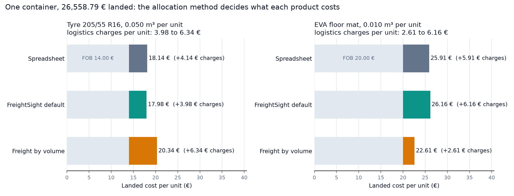
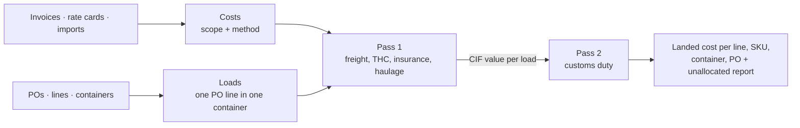
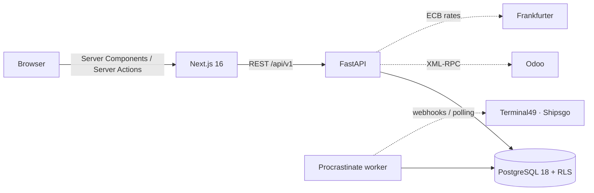

# FreightSight

Landed cost per SKU for importers: every freight, port, customs and haulage charge allocated down to the
purchase-order line, in Decimal, to the cent, with the method written on each cost.

[](https://github.com/Pchambet/freightsight-landed-cost/actions/workflows/ci.yml)


[](LICENSE)



> This public repository is a squashed, source-available snapshot of a privately developed product
> (FastAPI + PostgreSQL back end, Next.js front end). The development history lives in the private
> repository. Status: pre-alpha, built and maintained by one person.

## TL;DR

- **The question.** An importer pays one forwarder invoice for a container that carries several
  products. What did *each* product actually cost, landed? The allocation key alone (value, volume,
  weight…) can move a product's unit cost by double-digit percentages (+13 % / −14 % in the example
  below), and a spreadsheet split pro rata of value never makes that choice explicit.
- **Worked example below, run on the real engine:** on the same 26,558.79 € container, charging freight
  by volume instead of by value moves a tyre's landed cost from 17.98 € to 20.34 € (+2.36 €, +13 %) and
  a floor mat's from 26.16 € to 22.61 € (−3.55 €, −14 %). Totals are identical; the margin per product
  is not.
- **Allocation engine:** a pure function (no I/O), two passes because EU customs duty is assessed on the
  CIF value, largest-remainder rounding so the parts of every charge sum exactly to the charge, and
  anything that cannot be allocated is reported with its cause, never guessed.
- **996 backend tests** (752 test functions) run against a real PostgreSQL 18 with Row Level Security:
  994 pass locally in 2 to 5 minutes, 2 skip (no live Odoo; the backup round-trip needs a directly
  reachable Postgres and a `pg_dump` 18 client, both provided in CI). CI also type-checks (mypy, strict
  on the costing core), audits dependencies, checks migrations and runs gitleaks.
- **Invoice reading bench:** a rule-based PDF reader scored on 55 generated forwarder invoices
  (9 layout families + 7 traps written blind): 302 / 302 lines, 0 invented, **0 silent errors**. The
  first blind run of the traps scored 79 % with 2 silent errors; the [bench write-up](docs/invoice-reading-bench.md)
  explains what changed and what these numbers do not prove.

## Worked example

Container `MSCU4821990` from the bundled sample dataset (Ningbo → Le Havre, 40' high cube): 750 tyres
and 500 EVA floor mats from two purchase orders, and the five actual lines of the demo forwarder invoice
(ocean freight 3,915.40 €, THC 268.00 €, customs brokerage 142.50 €, haulage 396.00 €, customs duty
1,336.89 €). Landed cost per unit = (FOB + allocated charges) / quantity:

<!-- worked-example:start -->
| SKU | Qty | FOB / unit | Spreadsheet | FreightSight default | Freight by volume |
|---|--:|--:|--:|--:|--:|
| `TYR-20555R16-91V` (Tyre 205/55 R16, 0.050 m³) | 750 | 14.00 € | 18.14 € | 17.98 € | 20.34 € |
| `MAT-EVA-6040-GY` (EVA floor mat, 0.010 m³) | 500 | 20.00 € | 25.91 € | 26.16 € | 22.61 € |

- **Spreadsheet**: every charge pro rata of FOB value.
- **FreightSight default**: value pro rata, duty on each line's rate times CIF value (second pass).
- **Freight by volume**: freight, THC and haulage by m³, duty on rate times CIF value.

Container landed cost: **26,558.79 €** under all three policies (the parts of every charge sum to the cent).
<!-- worked-example:end -->

The tyres fill 37.5 of the 42.5 m³ loaded but only 51 % of the value. If space is what drives the freight
charge, a value split has the mats subsidise the tyres' freight; a volume split puts it on the tyres, and
because ocean freight enters the customs value, they also carry more of the duty. Which policy is right
is a business decision (what drives the charge?), which is why FreightSight writes the method on each
cost and shows a "what if" preview before anything is saved. The "FreightSight default" column is
exactly what the application displays for this container: `backend/tests/test_demo_story.py` pins
17.9750 € and 26.1550 € through the API and a real database, and `backend/tests/test_worked_example.py`
fails if this table drifts from `backend/scripts/worked_example.py`.

```bash
cd backend && uv run python scripts/worked_example.py          # prints the table above
uv run --with matplotlib python scripts/worked_example.py --figure ../docs/figures/worked-example.png
```

## Why it matters

Small importers often price on FOB and learn their real cost per purchase order weeks later, once the
forwarder, customs and demurrage invoices have arrived. Meanwhile they set selling prices and reorder on a
unit cost that is wrong in a direction nobody checks. FreightSight gives that unit cost early (from rate
cards, as an estimate), replaces each estimate by the invoiced amount when it lands, and reports the
variance, so the decision is made on a number whose provenance is visible.

## How the engine works



1. **Leaves.** A *load* is one purchase-order line inside one container (a PO can be split across
   containers; a container can carry several POs). Every cost targets a shipment, container, PO or line
   and cascades to the loads below it.
2. **Methods.** By value, weight, volume, quantity, manual percentages, CIF value or theoretical duty
   (each line's tariff rate × its CIF value). Customs duty defaults to theoretical duty only when every
   line has a rate and the rates explain the duty paid within 20 %; otherwise it falls back to CIF value
   and says so in a note.
3. **Exact money.** `split_largest_remainder` floors each part to the cent and hands the remaining cents
   to the largest fractional remainders, ties broken by a stable key; credit notes are split as the
   mirror of the invoice they correct. The invariant "parts sum to the charge" is checked at runtime, not
   with an `assert`.
4. **Nothing guessed.** A missing weight, an empty target or a manual split that does not sum to 100 %
   lands in `unallocated` with a code and the offending lines; a line that received nothing because its
   basis is zero is reported as a note.
5. **Estimate → actual.** Each cost is an *estimate* (from rate cards) or an *actual* (invoiced, at the
   ECB rate of the invoice date). An invoice line supersedes the estimate it replaces; reports show the
   variance and how many cost types are still waiting for an invoice.

Code: [`backend/app/domain/costing/engine.py`](backend/app/domain/costing/engine.py) (313 lines, mypy
strict) and its reference cases in [`backend/tests/test_engine.py`](backend/tests/test_engine.py).

## What works today

- **Purchase orders and containers**: lines with SKU, quantity, unit price, weight, volume, HS code and
  duty rate, in any currency at a fixed FX rate; containers loaded with a quantity of each line.
- **Costs** scoped to a shipment, container, PO or line (ocean freight, THC, insurance, customs duty,
  haulage, demurrage…), stored in the invoice currency with the ECB rate of the invoice date. Import VAT
  is tracked for the cash view and excluded from the landed cost.
- **Landed cost** per PO line with unit cost, per container, shipment or PO, and a live "what if" preview
  that switches the method per cost type without saving.
- **Import wizard** for CSV/XLSX: column mapping remembered per file layout, dry-run validation with
  row-level errors, French Excel exports (BOM, `;`, `12 500,50`, cp1252) handled, re-imports idempotent.
- **Invoice inbox**: a forwarder PDF is read (rule-based by default, an LLM extractor behind a key); each
  line is proposed with amount, currency, cost type and target, and **nothing becomes a cost until a
  person confirms it**.
- **Container tracking and demurrage risk**: milestones, last free day and a two-clock
  demurrage/detention risk, from manual entry or tracking providers (Terminal49 and Shipsgo adapters,
  HMAC-verified webhooks, polling worker).
- **Background jobs and alerts** on a Procrastinate worker (Postgres queue): webhook replays, silent
  subscription polling, daily risk recomputation, in-app and e-mail alerts.
- **Odoo 17 connector**: reads confirmed purchase orders incrementally and writes a container's landed
  cost back as a *draft* in `stock_landed_costs`, with a preview of the exact document first; it never
  validates an entry in the customer's books. Engineering log against a real Odoo 17 instance (in
French): [`docs/odoo-questions.md`](docs/odoo-questions.md).
- **Reports and exports**: landed cost by supplier, route, month or cost type; demurrage paid vs avoided;
  unit cost history per SKU; CSV exports in French or English.
- **Audit log**: append-only, with before/after values.
- **Multi-tenancy**: Clerk sign-in with mandatory organizations; the API verifies the session token
  against Clerk's JWKS and scopes every query to the organization, and PostgreSQL Row Level Security
  enforces the scope a second time (tests cover RLS on every tenant table).
- **Operations**: French by default with English (next-intl), Sentry, JSON request logs with request id,
  nightly encrypted `pg_dump` to S3-compatible storage (restore covered by an automated test, not yet
  rehearsed on production data), security headers, secret scanning in CI.

## What is manual or missing

| Area | State |
|---|---|
| Tracking coverage | Terminal49's free plan no longer includes webhooks; the Shipsgo adapter targets their v2 API and has not been exercised on a live account. Manual entry always works. |
| Invoice extraction | Scanned PDFs (no text layer) are not read: no OCR yet. The bench uses generated invoices, not customer ones. The LLM extractor needs a key and is not benchmarked. Review is mandatory either way. |
| Odoo write-back scope | Odoo 17 with `stock_landed_costs` only. Several receipts for one container are refused, not split. The landed-cost product and journal are the first found, not configurable yet. Product categories must use automated valuation with FIFO or average cost, which is not Odoo's default. |
| Other ERPs, accounting, billing | Pennylane, Sage exports, Stripe: not built. |
| In-app invitations and roles | Delegated to Clerk's own components for now. |

## Architecture



- `backend/app/domain/costing/engine.py` is a pure function: engine inputs in, allocations out, no I/O.
  `service.py` materialises the result per organization in the same transaction as any write.
- `backend/app/core/tenancy.py` sets the `app.org_id` session variable read by every RLS policy.
- `frontend/src/lib/api/client.ts` is a typed `openapi-fetch` client generated from the backend OpenAPI
  schema. The browser never calls the API directly.

## Getting started

Prerequisites: Docker, Node 22+, [uv](https://docs.astral.sh/uv/).

```bash
git clone https://github.com/Pchambet/freightsight-landed-cost.git && cd freightsight-landed-cost

# Backend + Postgres + background worker (migrations run automatically)
docker compose up -d --build
# API on http://localhost:8001, Swagger on http://localhost:8001/docs
# Worker: invoice extraction, tracking polls, alerts; check with `docker compose logs -f worker`

# Frontend: needs a Clerk development instance (free) with Organizations enabled
cd frontend
cat > .env.local <<'ENV'
API_URL=http://localhost:8001
NEXT_PUBLIC_CLERK_PUBLISHABLE_KEY=pk_test_...
CLERK_SECRET_KEY=sk_test_...
NEXT_PUBLIC_CLERK_SIGN_IN_URL=/sign-in
NEXT_PUBLIC_CLERK_SIGN_UP_URL=/sign-up
ENV
npm install
npm run dev                     # http://localhost:3000
```

For the local API to accept those sessions, put `CLERK_ISSUER` and `CLERK_JWKS_URL` in a repo-root `.env`
(see `.env.example`); docker compose passes them to the API. The API alone needs no Clerk account: docker
compose enables a development principal, so a request carrying an `X-Org-Id: <any uuid>` header acts as
the owner of that organization (the front end still requires Clerk).

Try it: on an empty organization, Containers → load the sample data, then upload
`docs/demo/fixtures/facture-transdemo-demo.pdf` in the invoice inbox and confirm its five lines: container
`MSCU4821990` lands on the worked example's "FreightSight default" figures. Or Imports → New import →
upload `backend/tests/fixtures/legacy_po_container.csv`, open a container, add an ocean freight cost and
switch the allocation method in the preview.

## Development

```bash
cd backend
uv sync --all-groups
uv run pytest            # throwaway Postgres 18 via testcontainers (Docker); 2-5 min on a laptop
uv run ruff check . && uv run ruff format --check . && uv run mypy .
PYTHONPATH=tests uv run python -m bench_invoices_scoring   # invoice-reading bench, prints the score table (labels in French)
uv run alembic revision --autogenerate -m "describe change"

cd ../frontend
npm run api:types        # regenerate src/lib/api/schema.d.ts after an API change
npm run typecheck && npm run lint && npm run build
npm run e2e              # Playwright smoke tests of the public pages, hermetic
```

Production must connect to Postgres as the non-superuser role `freightsight_app` created by migration
0003, otherwise Row Level Security is bypassed. CI runs the same commands against a Postgres 18 service
(production runs 18; the local compose file still ships 17).

## Repository layout

```
backend/
├── app/
│   ├── domain/costing/    allocation engine (pure), materialisation, landed-cost reports
│   ├── domain/…           imports, invoices, estimates, tracking, alerts, ERP, FX, audit, periods
│   ├── adapters/          PDF extraction, tracking providers, Odoo, FX, e-mail
│   ├── api/v1/            FastAPI routes and schemas
│   └── jobs/, worker.py   Procrastinate background jobs
├── migrations/            30 Alembic migrations, RLS policies included
├── scripts/               worked example, OpenAPI export, Odoo seed
└── tests/                 pytest suite + invoice-reading bench
frontend/                  Next.js app (see frontend/README.md)
docs/                      invoice bench write-up, Odoo engineering log, demo invoice fixture, figures
```

## Limitations

- **No customer data in this repository.** The worked example uses the bundled sample dataset, whose
  rates are realistic 2026 orders of magnitude (stated in `app/domain/sample_data.py`), not quotes from
  a forwarder. The mat's tariff heading (3926.90, 6.5 %) is an assumption without a binding ruling.
- **The method choice is not learned.** FreightSight computes exactly what a chosen method implies; it
  does not decide which method reflects what drives each charge. The default (value) is the
  conventional one, not a recommendation.
- **The invoice bench is self-written.** 100 % means the 9 families and 7 traps are covered, not that
  any forwarder's invoice will be read; the first blind traps scored 79 %.
- **Single-developer, pre-alpha product.** The public history is one squashed snapshot plus later
  documentation commits.

## License and contact

FreightSight is **source-available** under the [Functional Source License, version 1.1, MIT future
license](LICENSE) (FSL-1.1-MIT). You can read, run, modify and redistribute the code for any purpose other
than a *competing use*: offering it to others as a commercial product or service that replaces
FreightSight. Two years after each release, that release becomes available under the MIT license.

Questions and bugs: [GitHub issues](https://github.com/Pchambet/freightsight-landed-cost/issues). Commercial
use outside those terms, or a security report: pierrechambet@gmail.com.

---

Built by [Pierre Chambet](https://github.com/Pchambet) — decision science for operations under uncertainty.
