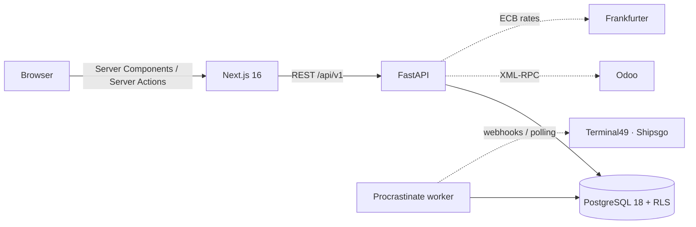

# FreightSight

Landed cost allocation and container tracking for SMB importers.

[](https://github.com/Pchambet/freightsight-landed-cost/actions/workflows/ci.yml)


**Status: pre-alpha.** Looking for design partners: importers who run Odoo 17. The sections below say
exactly what works, what is manual, and what is planned.

## The problem

SMB importers price on FOB and discover their real cost per purchase order 30 to 60 days later, once the
forwarder, customs and demurrage invoices have landed. Spreadsheets allocate freight pro rata of value,
which is wrong for anything bulky, and nobody reconciles one invoice against three containers and five POs.

FreightSight allocates logistics costs across purchase orders, lines and containers with an auditable
method, and will track containers and read invoices so the number is right before the last invoice arrives.

## What works today

- **Purchase orders with lines** (SKU, quantity, unit price, weight, volume, HS code, duty rate), in any
  currency with a fixed FX rate, and **containers loaded with a quantity of each line**. A PO can be split
  across containers; a container can carry several POs.
- **Costs with one scope** (shipment, container, PO or PO line) that cascade down to the loaded lines:
  ocean freight, THC, insurance, customs duty, drayage, demurrage and more. Each cost is stored in its
  invoice currency with the ECB rate fixed at the invoice date (or a manual rate), and carries a status:
  **estimate** (from the organization's rate cards) or **actual** (invoiced). An invoice supersedes the
  estimate it replaces; the reports show estimated vs actual, the variance and how many cost types are
  still waiting for an invoice.
- **Allocation engine**: by value, weight, volume, quantity or manual percentages, in Decimal with a
  largest-remainder split so the parts always sum to the cost. Customs duty is allocated in a second pass on
  the CIF basis (by theoretical duty when every line has a duty rate). Import VAT is tracked for the cash
  view and excluded from the landed cost. Anything that cannot be allocated is reported, never guessed.
- **Landed cost per PO line with unit cost**, per container, shipment or purchase order, plus a live
  "what if" preview that switches the method per cost type without saving.
- **Import wizard**: upload a CSV or XLSX, map the columns (remembered per file layout), get a dry-run
  validation report with row-level errors, then commit. Excel FR exports (BOM, `;`, `12 500,50`, accents)
  and cp1252 files are handled. Re-importing the same file is a no-op.
- **Invoice inbox**: upload a forwarder invoice (PDF or image); it is read (regex extractor by default, an
  LLM extractor behind a key), each line is proposed with amount, currency, cost type and target, and
  **nothing becomes a cost without a person confirming it**.
- **Container tracking**: milestones, discharge date, free days, last free day and a two-clock
  demurrage/detention risk derived from them. Events come from manual entry or from a tracking provider
  (Terminal49 and Shipsgo adapters, HMAC-verified webhooks, polling by the worker); the provider is an
  organization setting. ETA changes are kept as history.
- **Alerts and background jobs**: a Procrastinate worker on Postgres replays failed webhook deliveries,
  polls silent subscriptions, recomputes the risk every morning and raises alerts (bell in the app; e-mail
  through Resend when a key is set).
- **Odoo 17 connector**: reads confirmed purchase orders (incremental on `write_date`, cancelled orders
  marked, quantities converted from the line's unit of measure) and, the other way, creates the
  **landed cost of a container as a draft** in `stock_landed_costs`, one cost line per invoice, our own
  split written per receipt line. A preview shows the exact document and what blocks it before anything is
  written; FreightSight never validates an entry in the customer's books. Field notes and the measured
  Odoo behaviour are in `docs/odoo-questions.md`.
- **Reports and exports**: landed cost by supplier, route, month or cost type; demurrage paid vs avoided
  with the rule cited; unit cost history per SKU; CSV exports in French or English (BOM, `;`).
- **Audit log**: append-only, with before/after values, shown per container and as a page.
- **Authentication and tenancy**: Clerk sign-in with mandatory organizations; the Next app sends the
  user's session token to the API, which verifies it against Clerk's JWKS, mirrors user, organization
  and membership locally, and scopes every query to that organization. Postgres Row Level Security
  enforces the scope a second time. In development only (`APP_ENV=dev`), an `X-Org-Id` header can stand
  in for a token; production refuses to start without Clerk configuration.
- **Operations**: French by default with English kept (next-intl), Sentry on API, worker and web, JSON
  request logs with a request id, nightly encrypted `pg_dump` to S3-compatible storage (the restore is covered by an
  automated test, and has not yet been rehearsed on production data), security headers, secret scanning in CI.

## What is manual or missing

| Area | State |
|---|---|
| Tracking coverage | Terminal49's free plan no longer includes webhooks; Shipsgo adapter targets their v2 API and is not yet exercised on a live account. Manual entry always works. |
| Invoice extraction quality | The regex extractor misses some lines (a "Frais de B/L" line, VAT read wrong on one fixture); the LLM extractor needs a key. Review is mandatory either way. |
| Odoo write-back scope | Odoo 17 with `stock_landed_costs` only. Several receipts for one container are refused, not split. The landed-cost product and journal are the first found, not configurable yet. Product categories must be in automated valuation with FIFO or average cost, which is not Odoo's default. |
| Other ERPs, accounting, billing | Pennylane, Sage exports, Stripe: not built (Phase 3). |
| Invitations and role management inside the app | Handled in Clerk's own components for now (organization switcher, user button). |

## Architecture



- `backend/app/domain/costing/engine.py` is a pure function: engine inputs in, allocations out, no I/O.
  `service.py` materialises the result per organization in the same transaction as any write.
- `backend/app/core/tenancy.py` sets the `app.org_id` session variable read by every RLS policy.
- `frontend/src/lib/api/client.ts` is a typed `openapi-fetch` client generated from the backend OpenAPI.
  The browser never calls the API directly.

## Getting started

Prerequisites: Docker, Node 22+, [uv](https://docs.astral.sh/uv/).

```bash
git clone https://github.com/Pchambet/freightsight-landed-cost.git && cd freightsight-landed-cost

# Backend + Postgres + background worker (migrations run automatically)
docker compose up -d --build
# API on http://localhost:8001, Swagger on http://localhost:8001/docs
# Worker: invoice extraction, tracking polls, alerts — check with `docker compose logs -f worker`

# Frontend: needs a Clerk development instance (free) with Organizations enabled
cd frontend
cat > .env.local <<'EOF'
API_URL=http://localhost:8001
NEXT_PUBLIC_CLERK_PUBLISHABLE_KEY=pk_test_...
CLERK_SECRET_KEY=sk_test_...
NEXT_PUBLIC_CLERK_SIGN_IN_URL=/sign-in
NEXT_PUBLIC_CLERK_SIGN_UP_URL=/sign-up
EOF
npm install
npm run dev                     # http://localhost:3000
```

For the local API to accept those sessions, put `CLERK_ISSUER` and `CLERK_JWKS_URL` in a repo-root `.env`
(see `.env.example`); docker compose passes them to the API.

Try it: Imports → New import → upload `backend/tests/fixtures/legacy_po_container.csv`, then open a
container, add an ocean freight cost, and switch the allocation method in the preview.

## Development

```bash
cd backend
uv sync --all-groups
uv run pytest            # throwaway Postgres via testcontainers; covers RLS, JWT, engine, ERP, backups
uv run ruff check . && uv run ruff format --check . && uv run mypy .
uv run alembic revision --autogenerate -m "describe change"

cd ../frontend
npm run api:types        # regenerate src/lib/api/schema.d.ts after an API change
npm run typecheck && npm run lint && npm run build
```

Production must connect to Postgres as the non-superuser role `freightsight_app` created by migration
0003, otherwise Row Level Security is bypassed. CI runs the same commands against a Postgres 18 service (production runs 18; the local compose file still ships 17).

## License

FreightSight is **source-available** under the [Functional Source License, version 1.1, MIT future
license](LICENSE) (FSL-1.1-MIT). You can read, run, modify and redistribute the code for any purpose other
than a *competing use*: offering it to others as a commercial product or service that replaces FreightSight.
Two years after each release, that release becomes available under the MIT license.

For a commercial use outside those terms, get in touch through the contact address on the project's site.
